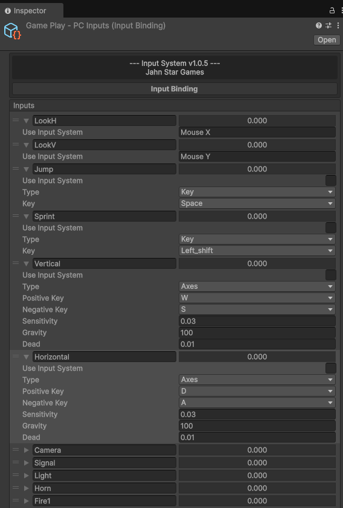

# JSG Input Manager

JSG Input Manager is a flexible and powerful input management system for Unity. It provides a streamlined way to handle various input methods including keyboard, gamepad, mobile touch controls, gyroscope, and UI-based inputs.

The system allows you to create customizable input bindings and easily reference them in your game logic, providing a unified approach to handle input across different platforms. One of its key strengths is its ability to serve as a bridge between different input systems by emulating inputs programmatically, making it extremely versatile for complex game development scenarios.





## Features

- **Input Binding System**: Create reusable input configurations as ScriptableObjects
- **Multi-platform Support**: Seamlessly handle inputs from keyboard, mouse, gamepad, and touch
- **Input Emulation**: Act as a bridge between different input systems by emulating inputs programmatically
- **State Management**: Comprehensive input state handling (pressed, released, held)
- **UI Input Components**: Ready-to-use UI components for virtual joysticks and buttons
- **Customizable D-pad**: Full directional control with customizable events
- **Additional Controls**:
  - Steering Wheel
  - Gyroscope
  - Gear Shifter
- **Editor Integration**: Custom inspector windows for easy configuration

## Installation

### Using Unity Package Manager

1. Open the Package Manager in Unity (Window > Package Manager)
2. Click the "+" button and select "Add package from git URL..."
3. Enter `com.jahnstargames.inputmanager`
4. Click "Add"

### Manual Installation

1. Download the latest release
2. Extract the contents into your Unity project's Packages folder

## Quick Start

### Creating an Input Binding

1. Right-click in the Project window
2. Select "Create > Jahn Star Games > Input Manager > Create Input Binding"
3. Configure your inputs in the Inspector

### Using Input Bindings in Code

```csharp
using JahnStarGames.InputManager;
public class PlayerController : MonoBehaviour
{
    public InputBinding inputBinding;
    
    void Update()
    {
        // Get axis input (-1.0 to 1.0)
        float horizontal = inputBinding.GetInput("Horizontal");
        float vertical = inputBinding.GetInput("Vertical");
        
        // Get button input (0 or 1)
        float jumpButton = inputBinding.GetInput("Jump");
        
        // Get button down (returns 1 only on the first frame the button is pressed)
        float fireButtonDown = inputBinding.GetInput("Fire1", 0);
        
        // Get button up (returns 1 only on the frame the button is released)
        float fireButtonUp = inputBinding.GetInput("Fire1", 2);
        
        // You can also get all the current input values as a dictionary
        Dictionary<string, float> allInputs = inputBinding.GetKeyValues();
    }
}
```

### Setting Up Mobile Controls

1. Add a UI_Input component to your UI elements
2. Assign your InputBinding
3. Configure the input name and axis/button properties
4. For joysticks, assign background and handle RectTransforms

## Components

### InputBinding

The core ScriptableObject that stores all your input configurations. Each input can be configured as:
- **Axis**: Provides a value between -1 and 1 (e.g., movement, steering)
- **Button**: Provides a value of 0 or 1 (e.g., jump, fire)

### UI_Input

Creates touch-based inputs on mobile platforms:
- Virtual joysticks (with customizable appearance and behavior)
- Touch buttons
- Supports both fixed and dynamic positioning

### UI_Dpad

Directional pad control with 8-way input and customizable events:
- Center, Up, Down, Left, Right
- Up-Left, Up-Right, Down-Left, Down-Right

### Additional Components

- **SteeringWheel**: Rotational input control perfect for driving games
- **Gyroscope**: Utilize device tilt for input
- **Shifter**: Multi-position selector (e.g., gear selection)

## Advanced Features

### Input Simulation

One of the most powerful features of JSG Input Manager is its ability to act as a bridge between different input systems and emulate inputs programmatically:

```csharp
// Simulate a button press
inputBinding.SimulateInput("Jump", 1); // Press down
inputBinding.SimulateInput("Jump", 2); // Release (up)
// Simulate an axis value (-1.0 to 1.0)
inputBinding.SimulateInput("Horizontal", 1, 0.75f); // Set horizontal axis to 0.75
// Input States:
// 0 = Not Pressed
// 1 = Key Press Down
// 2 = Key Up
```

This makes it possible to:
- Create custom input handling systems
- Implement AI controlled characters using the same input system as players
- Bridge between different input frameworks
- Create automated testing systems
- Implement tutorials with simulated inputs

### Input States

JSG Input Manager uses numeric values to represent different input states:

```csharp
// Button States
// 0 = Not Pressed  - Button is not being pressed
// 1 = Key Press Down - First frame when button is pressed
// 2 = Pressing - Button is being held down
// 3 = Key Up - First frame when button is released
// For UI_Input component, the keyState property reflects these states
if (uiInput.keyState == 1) {
    // Button just pressed
} else if (uiInput.keyState == 3) {
    // Button just released
}
```

### Remote Input

Link directly to Unity's Input System (OLD) for backward compatibility:
```csharp
// In the InputBinding inspector, set the "Remote" field to a valid Input axis/button name
// e.g., "Horizontal", "Jump", "Mouse X", etc.
```

### Dynamic Joysticks

Create joysticks that appear where the player touches:
```csharp
// In the UI_Input inspector, enable "Dynamic Bg"
```

### Distance-Based Input

Calculate input based on touch distance for finer control:
```csharp
// In the UI_Input inspector, enable "Calculate Distance"
```


## Development Status

> **Note:** This project was created in 2021 based on Unity's legacy Input Manager as a solution for cross-platform input handling. This means this package is no longer under active development.

For new projects, it is recommended to use Unity's new Input System as the primary input solution. However, the UI components in this package (UI_Input, UI_Dpad, SteeringWheel, etc.) can still provide excellent flexibility when integrated with Unity's modern input architecture, especially for mobile controls.

### Version History
- **v1.1.4** (2024): Added Advanced remote input
- **v1.1.3** (2023): Added Smooth Touching
- **v1.1.2** (2023): Fixed Distance method issues
- **v1.1.1** (2023): Fixed UI_Dpad snapHandle position, resetting events
- **v1.1.0** (2023): Added UI_Dpad enable events with images
- **v1.0.9** (2023): Added UI_Dpad component
- **v1.0.7** (2022): Fixed onDisable issue
- **v1.0.6** (2022): Fixed input simulating on UI_Input
- **v1.0.5.5** (2022): Added UI_Input Simulate InputBinding toggle
- **v1.0.5** (2022): Added UI_Input calculate axisValueDistance and simulate distance axisValue
- **v1.0.4.5** (2022): Fixed UI_Input origin handle and layout, added Simulate PointerDown axisValue
- **v1.0.4** (2022): Added UI_Input event invoking and keyState field
- **v1.0.3.1** (2022): Fixed InputBinding_Editor fields
- **v1.0.3** (2021): Fixed reset dynamic handle position
- **v1.0.2** (2021): Fixed minor errors

## Requirements

- Unity 2022.3.20f1 or newer

## License

This asset is provided as-is without any express or implied warranty.

## Contact

- **Developer**: Halil Emre Yildiz
- **Website**: [https://jahnstar.com](https://jahnstar.com)
- **Email**: contact@jahnstar.com
- **GitHub**: [JahnStar](https://github.com/JahnStar)

---

Made with ❤️ by Jahn Star